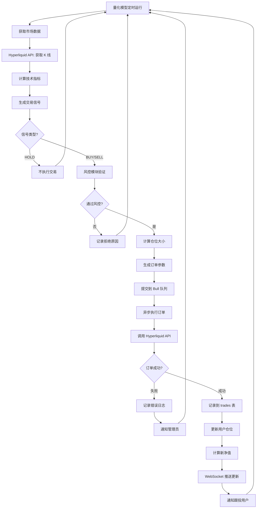
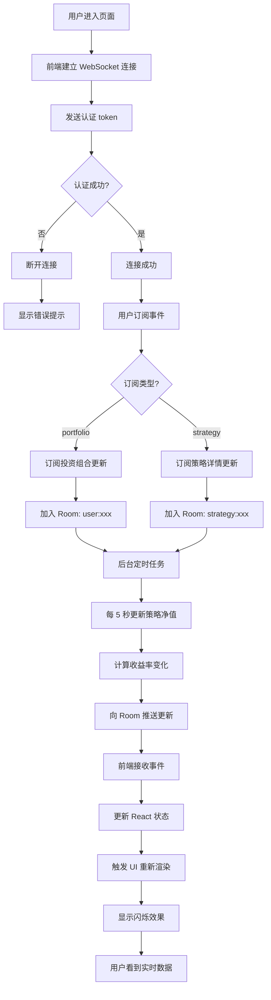
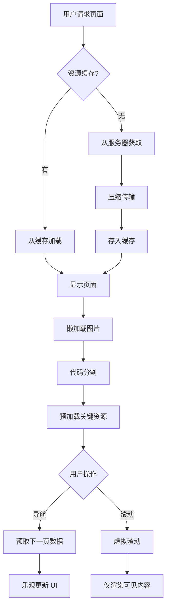
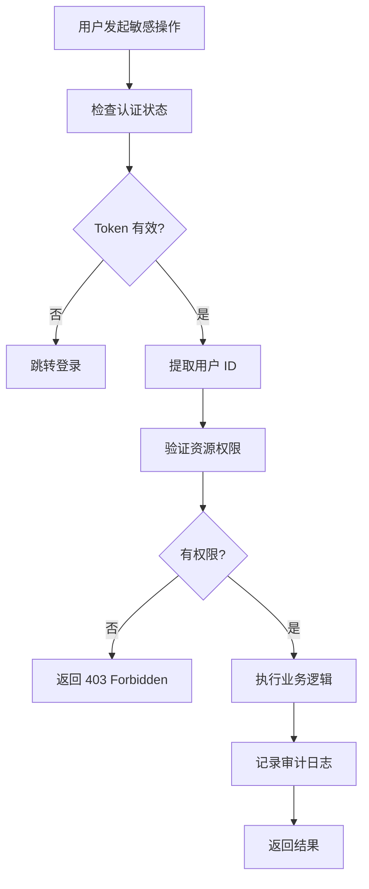

# Mirror-AI 用户流程图

> 版本：v1.0  
> 创建日期：2026-02-14  
> 目标：详细描述各个关键用户旅程

---

## 1. 新用户注册流程

```mermaid
graph TD
    A[用户访问首页] --> B{已连接钱包?}
    B -->|否| C[点击"连接钱包"]
    B -->|是| H[跳转策略广场]
    
    C --> D[弹出钱包选择模态框]
    D --> E[选择钱包类型]
    E --> F[MetaMask/WalletConnect/其他]
    
    F --> G[唤起钱包插件]
    G --> H1{用户授权?}
    
    H1 -->|拒绝| I[显示错误提示]
    I --> C
    
    H1 -->|授权| J[后端生成 nonce]
    J --> K[前端请求钱包签名]
    K --> L{签名成功?}
    
    L -->|失败| I
    L -->|成功| M[后端验证签名]
    
    M --> N{验证通过?}
    N -->|否| I
    N -->|是| O[生成 JWT Token]
    
    O --> P[存储到 localStorage]
    P --> Q[创建/更新用户记录]
    Q --> R[显示欢迎提示]
    R --> H
```

**关键步骤说明**：

1. **钱包选择**：支持 MetaMask、WalletConnect、Coinbase Wallet
2. **签名验证**：使用 EIP-191 标准签名，消息包含 nonce + timestamp
3. **会话创建**：JWT Token 有效期 24 小时，存储在 localStorage
4. **用户记录**：首次登录创建 users 表记录

---

## 2. 投资流程（核心）

```mermaid
graph TD
    A[用户浏览策略广场] --> B[点击策略卡片]
    B --> C[查看策略详情页]
    
    C --> D{决定投资?}
    D -->|放弃| A
    D -->|是| E[点击"立即投资"]
    
    E --> F{已连接钱包?}
    F -->|否| G[跳转连接钱包流程]
    G --> E
    
    F -->|是| H[显示投资面板]
    H --> I[输入投资金额]
    
    I --> J{金额验证}
    J -->|< $1| K[显示错误: 最低 $1]
    K --> I
    
    J -->|≥ $1| L[计算手续费]
    L --> M[显示确认信息]
    
    M --> N{用户确认?}
    N -->|取消| H
    N -->|确认| O[唤起钱包签名]
    
    O --> P{签名成功?}
    P -->|失败| Q[显示错误提示]
    Q --> H
    
    P -->|成功| R[后端调用 Hyperliquid API]
    R --> S[资金转入策略托管地址]
    
    S --> T{转账成功?}
    T -->|失败| U[返回资金/提示错误]
    U --> H
    
    T -->|成功| V[创建/更新 user_positions]
    V --> W[更新 strategy AUM]
    W --> X[WebSocket 推送更新]
    
    X --> Y[显示成功提示]
    Y --> Z[跳转个人中心]
```

**关键步骤说明**：

1. **金额验证**：前端 + 后端双重验证（最低 $1）
2. **手续费计算**：原手续费 + 平台加成（约 2%）
3. **签名确认**：用户签名授权转账
4. **资金转移**：通过 Hyperliquid API 转入策略托管地址
5. **数据更新**：
   - 创建/更新 user_positions
   - 更新 strategy.total_aum
   - 推送实时更新到前端

---

## 3. 查看投资组合流程

```mermaid
graph TD
    A[用户登录后] --> B[点击"我的投资"]
    B --> C[加载用户数据]
    
    C --> D[查询 user_positions]
    D --> E[查询关联的 strategies]
    E --> F[计算实时净值]
    
    F --> G[WebSocket 连接建立]
    G --> H[订阅用户投资组合]
    
    H --> I[渲染个人中心页面]
    I --> J[显示总资产/收益/仓位列表]
    
    J --> K{用户操作}
    K -->|查看策略详情| L[点击仓位卡片]
    K -->|追加投资| M[点击"追加"]
    K -->|赎回| N[点击"赎回"]
    
    L --> O[跳转策略详情页]
    M --> P[进入投资流程]
    N --> Q[进入赎回流程]
    
    J --> R[WebSocket 实时推送]
    R --> S[净值变化]
    S --> T[更新页面数据]
    T --> J
```

**实时数据更新**：

- **WebSocket 推送频率**：每 5 秒（策略净值变化）
- **前端刷新**：使用 React Query 自动刷新
- **闪烁效果**：数据变化时短暂高亮

---

## 4. 赎回流程

```mermaid
graph TD
    A[用户在个人中心] --> B[点击"赎回"]
    B --> C[显示赎回确认模态框]
    
    C --> D[计算当前价值]
    D --> E[显示可赎回金额]
    
    E --> F{用户选择}
    F -->|部分赎回| G[输入赎回金额]
    F -->|全部赎回| H[自动填充全额]
    
    G --> I{金额验证}
    I -->|超过持仓| J[显示错误提示]
    J --> G
    
    I -->|有效| K[显示预期到账金额]
    H --> K
    
    K --> L{用户确认?}
    L -->|取消| A
    L -->|确认| M[唤起钱包签名]
    
    M --> N{签名成功?}
    N -->|失败| O[显示错误提示]
    O --> C
    
    N -->|成功| P[后端调用 Hyperliquid API]
    P --> Q[平仓对应份额]
    
    Q --> R{平仓成功?}
    R -->|失败| S[显示错误提示]
    S --> C
    
    R -->|成功| T[资金返回用户钱包]
    T --> U[更新 user_positions]
    U --> V[更新 strategy AUM]
    
    V --> W[记录 realized_pnl]
    W --> X[WebSocket 推送更新]
    
    X --> Y[显示成功提示]
    Y --> Z[刷新个人中心]
```

**关键步骤说明**：

1. **实时价值计算**：基于策略最新净值
2. **平仓逻辑**：按用户持有份额比例平仓
3. **资金返回**：通过 Hyperliquid API 转回用户钱包
4. **盈亏记录**：更新 realized_pnl 字段

---

## 5. 策略信号执行流程（后台）



**执行频率**：

- **黄金/BTC 策略**：每小时检查一次
- **龙头跟单**：每 10 秒检查一次（监听见崎账户）

---

## 6. 实时数据推送流程



**推送事件类型**：

| 事件名 | 说明 | 推送频率 |
|--------|------|----------|
| `portfolio:update` | 投资组合数据更新 | 5 秒 |
| `strategy:update` | 策略数据更新 | 5 秒 |
| `trade:notification` | 交易通知 | 实时 |
| `system:alert` | 系统消息 | 按需 |

---

## 7. 错误处理流程

```mermaid
graph TD
    A[操作失败] --> B{错误类型?}
    
    B -->|网络错误| C[显示"网络异常，请重试"]
    C --> D[提供重试按钮]
    
    B -->|认证失败| E[显示"登录已过期"]
    E --> F[跳转连接钱包]
    
    B -->|余额不足| G[显示"余额不足"]
    G --> H[提示充值]
    
    B -->|签名被拒| I[显示"交易已取消"]
    I --> J[返回上一步]
    
    B -->|服务器错误| K[显示"系统繁忙"]
    K --> L[记录错误日志]
    L --> M[通知开发团队]
    
    B -->|未知错误| N[显示通用错误提示]
    N --> L
```

**错误提示规范**：

- **用户友好**：避免技术术语
- **可操作**：提供明确的下一步建议
- **有反馈**：记录日志，便于排查

---

## 8. 移动端适配流程

```mermaid
graph TD
    A[用户访问网站] --> B{设备类型?}
    
    B -->|桌面| C[加载完整布局]
    B -->|移动端| D[加载移动布局]
    
    D --> E[顶部导航变汉堡菜单]
    E --> F[卡片垂直堆叠]
    F --> G[图表尺寸缩小]
    
    G --> H{功能可用性}
    H -->|完整| I[所有功能正常]
    H -->|受限| J[部分功能提示"请使用桌面端"]
    
    I --> K[触摸手势支持]
    K --> L[左滑/右滑切换]
    L --> M[下拉刷新]
    
    M --> N[用户体验优化]
```

**移动端优化**：

- **响应式布局**：Tailwind CSS 断点
- **触摸优化**：按钮最小 44×44px
- **图表简化**：隐藏次要信息

---

## 9. 性能优化流程



**性能目标**：

- **首屏加载**：< 2 秒
- **交互响应**：< 100ms
- **API 请求**：< 500ms

---

## 10. 安全验证流程



**安全检查清单**：

- ✅ JWT Token 验证
- ✅ 用户资源隔离
- ✅ 敏感操作审计
- ✅ 输入参数验证
- ✅ SQL 注入防护

---

*文档版本：v1.0*  
*最后更新：2026-02-14*
